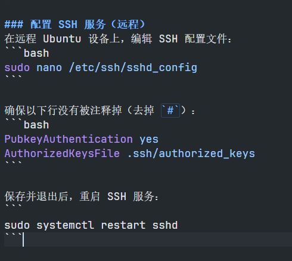

### 首次配置(本机)
打开 **Git Bash** 或 **PowerShell**，并使用以下命令生成 SSH 密钥对：
```powershell
ssh-keygen -t rsa -b 2048
```
- 该命令会提示你选择文件保存位置，默认是 `C:\Users\<YourUsername>\.ssh\id_rsa`，直接按回车键确认。
- 系统会提示你输入 passphrase（密码短语），你可以选择不输入，直接按回车跳过。
### 复制公钥（本机）
打开 PowerShell 或 Git Bash，运行以下命令：
```powershell
cat ~/.ssh/id_rsa.pub
```
这将显示你的公钥。将其内容复制到剪贴板。

密钥格式
一般密钥格式为 `<key-type> <key-data> <comment>`

例如：`ssh-rsa XXXXXXXXXXXXXXXXXXX user@hostname` 复制时注意要全部包括进去


登录到远程 Ubuntu 设备：
```
ssh username@remote_host
```

在远程设备上将公钥添加到 `authorized_keys` 文件:
```
mkdir -p ~/.ssh
echo "你的公钥内容" >> ~/.ssh/authorized_keys
chmod 600 ~/.ssh/authorized_keys
chmod 700 ~/.ssh
```

### 配置 SSH 服务（远程）
在远程 Ubuntu 设备上，编辑 SSH 配置文件：
```bash
sudo nano /etc/ssh/sshd_config
```

确保以下行没有被注释掉（去掉 `#`）：
```bash
PubkeyAuthentication yes
AuthorizedKeysFile .ssh/authorized_keys
```

保存并退出后，重启 SSH 服务：
```
sudo systemctl restart sshd
```

